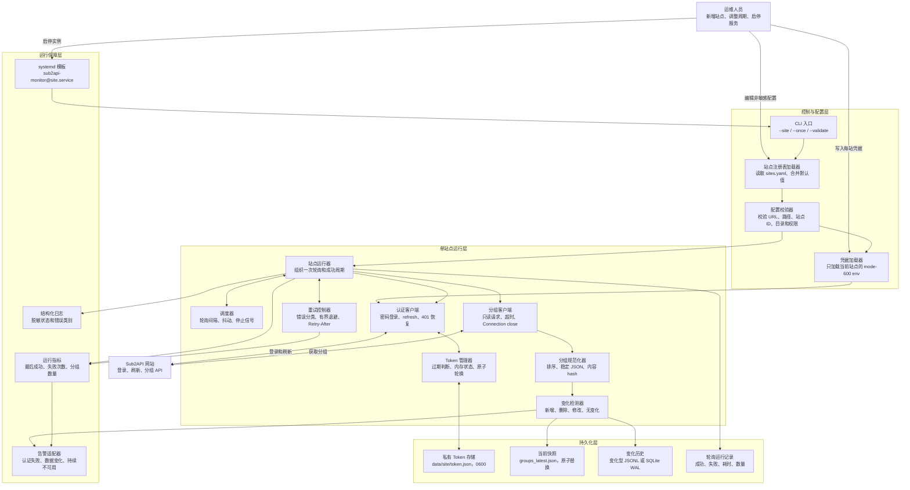
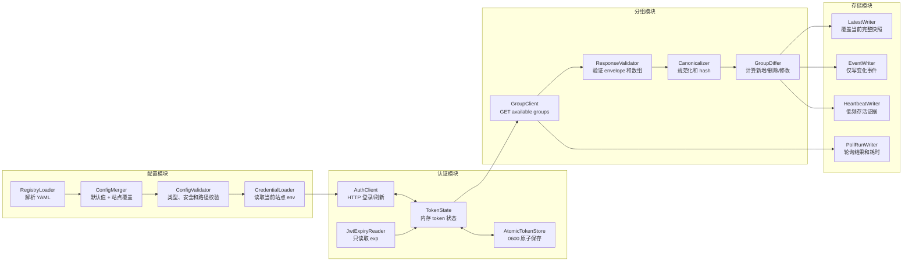
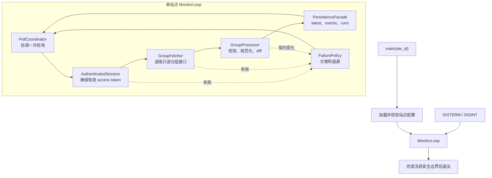
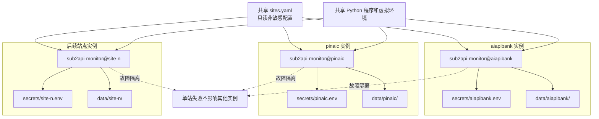
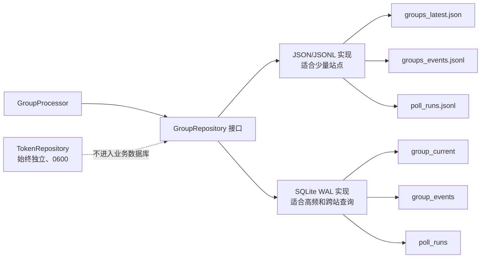
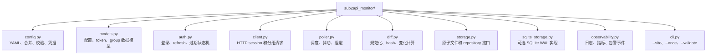

# Sub2API 多站点监控模块结构

本文描述目标系统包含哪些模块、每个模块负责什么，以及模块之间的依赖关系。详细实施约束见
[Sub2API 多站点分组监控设计与实施方案](./sub2api-multi-site-monitor-design.md)。

## 1. 总体模块结构

## 2. 模块职责分解

## 3. 单站点进程内部结构

## 4. 多站点部署结构

## 5. 存储模块演进结构

## 6. 代码模块建议

