# Sub2API 多站点监控数据流

本文描述数据从配置和网站进入监控系统后，如何经过认证、轮询、处理、持久化和告警。
模块职责见
[Sub2API 多站点监控模块结构](./sub2api-multi-site-monitor-architecture.md)。

## 1. 端到端数据流

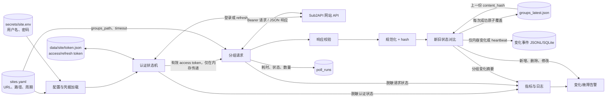

## 2. 启动与配置数据流

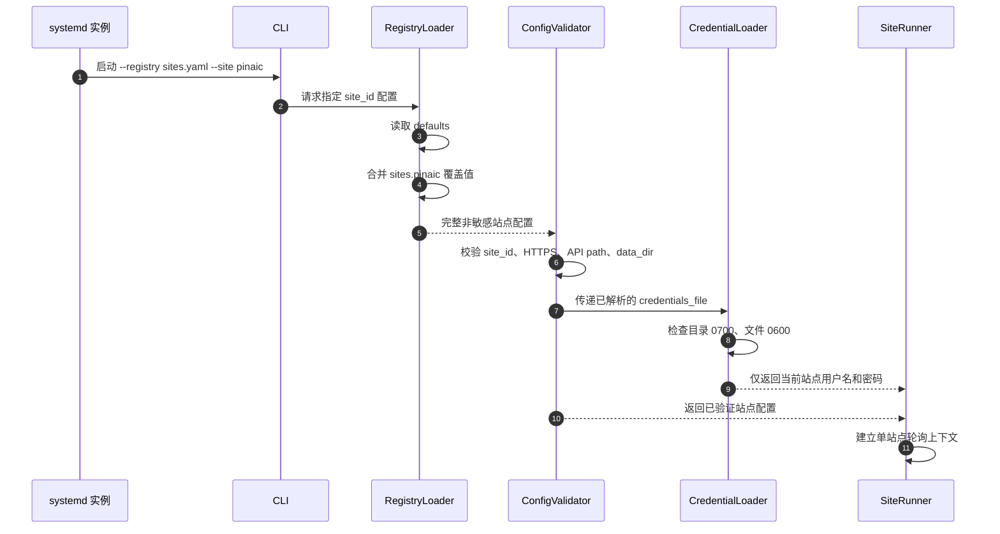

## 3. 登录、Refresh 与 Token 数据流

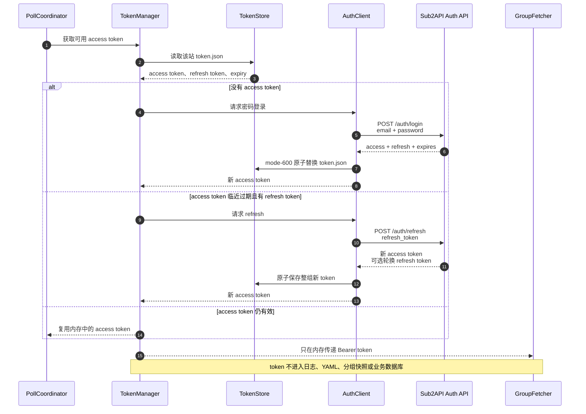

## 4. 401 恢复数据流

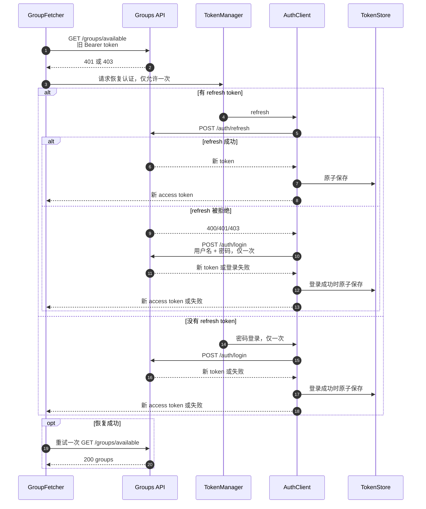

## 5. 分组响应处理数据流

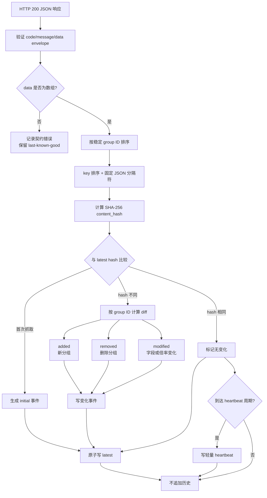

## 6. 文件持久化数据流

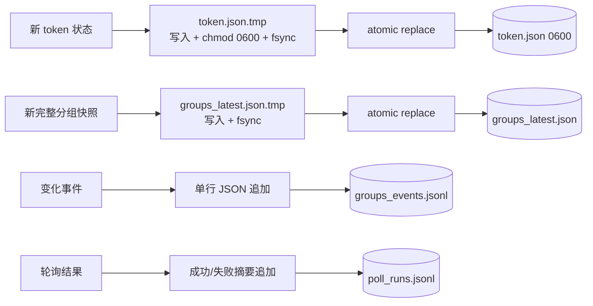

## 7. SQLite WAL 数据流

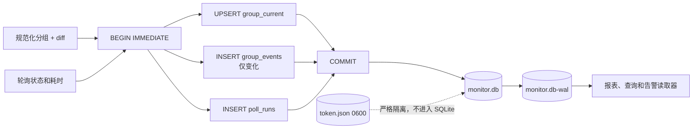

## 8. 成功周期与调度数据流

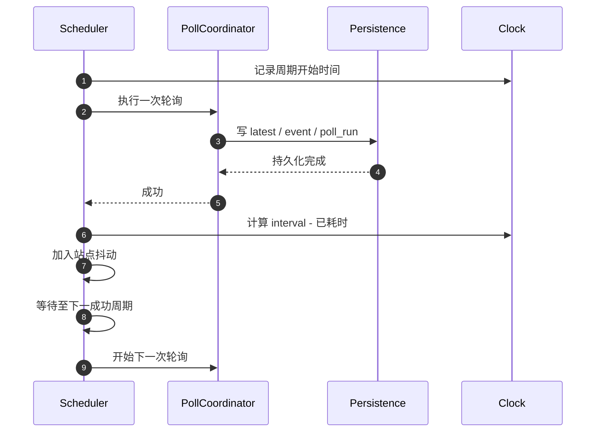

## 9. 失败与退避数据流

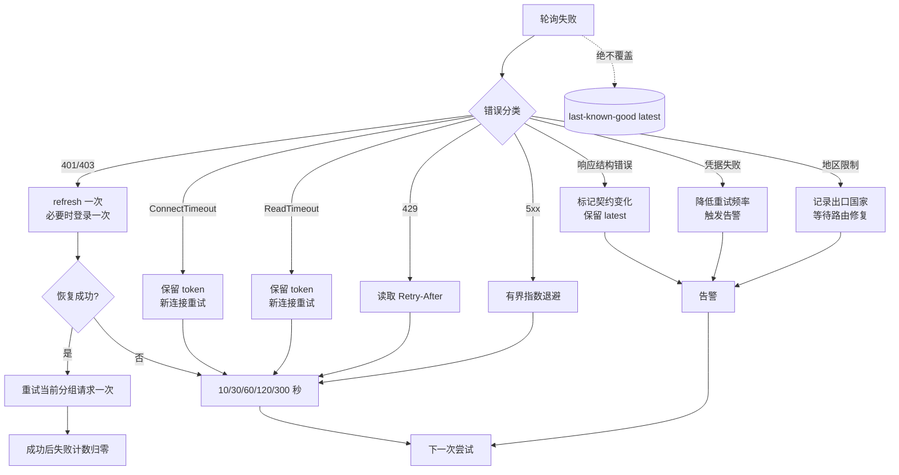

## 10. 告警数据流

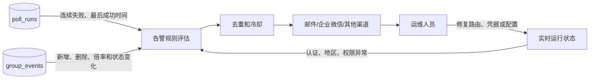

## 11. 新增站点的数据流

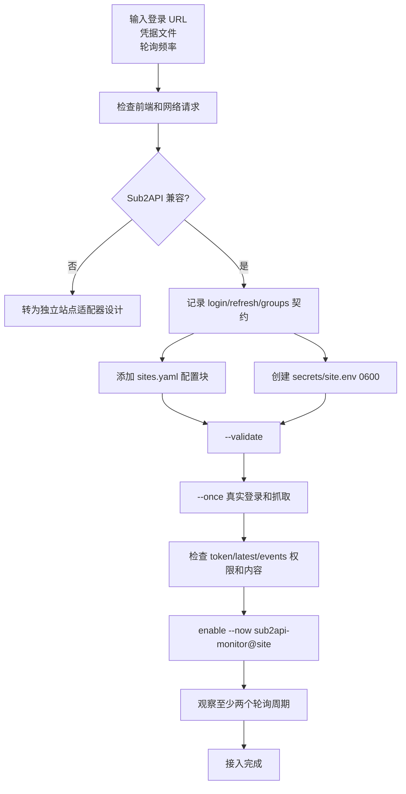

