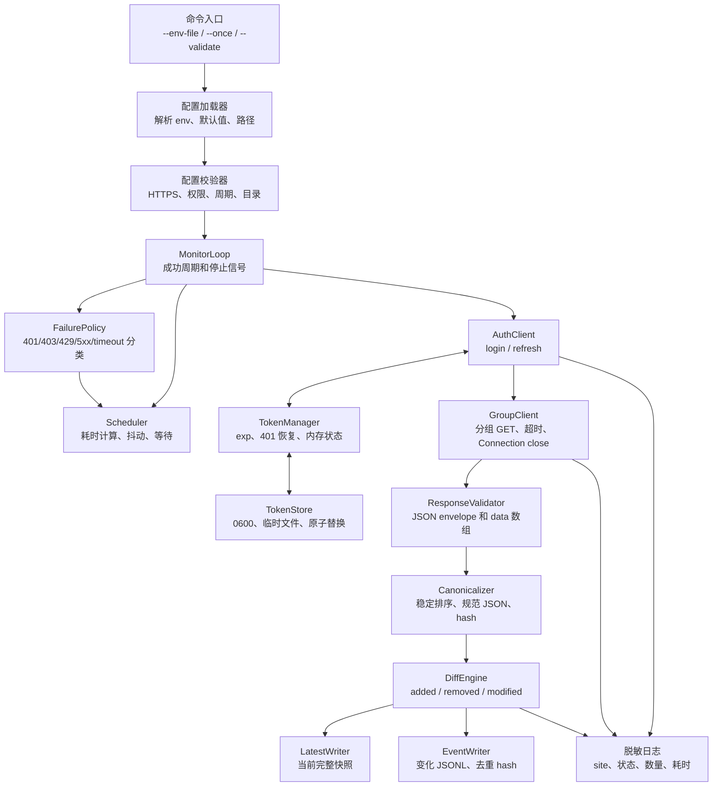
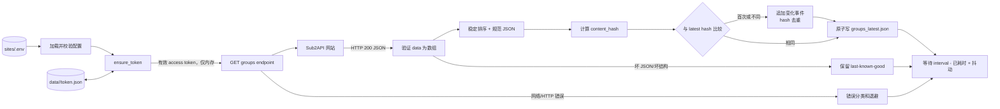
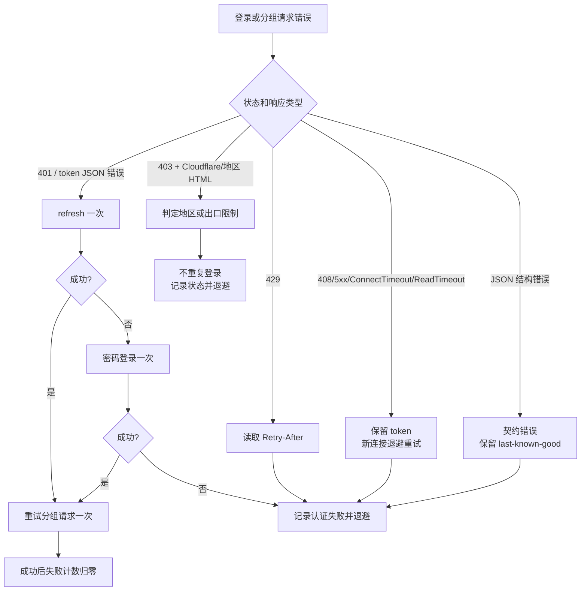
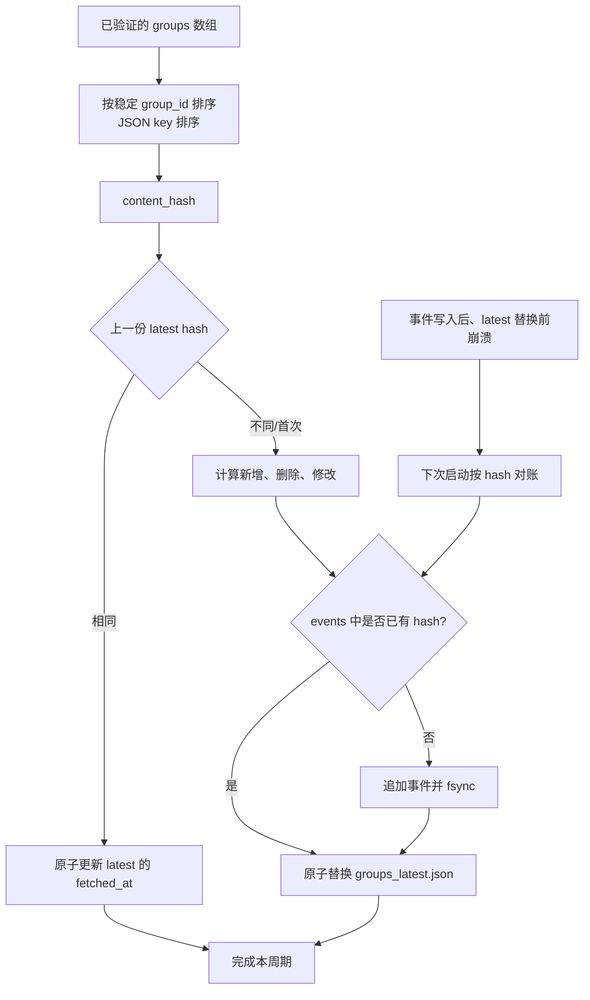
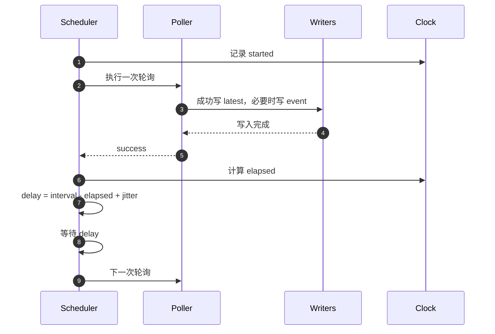
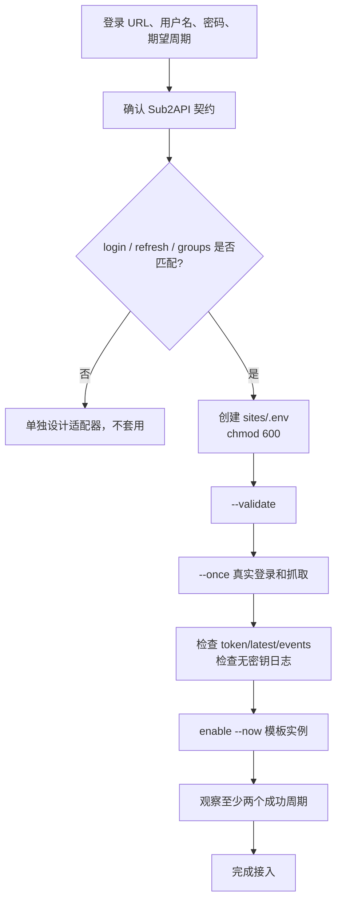

# Sub2API 分组监控最终方案

## 1. 方案结论

第一版采用“一个公共脚本、每站一个 env、每站一个 systemd 模板实例”的方案：

- 不引入 `sites.yaml`，避免增加 YAML 依赖和配置层级。
- 不引入 SQLite、Prometheus、独立告警服务或多适配器框架。
- 每个站点独立保存配置、token、当前快照和变化历史。
- 默认每 5 分钟轮询一次，确实需要时可配置为 60 秒以上。
- access token 临近过期时 refresh，不按轮询频率刷新 token。
- 分组快照每次成功更新，历史只记录分组内容变化。
- 认证失败、网络失败、地区限制和接口契约错误分别处理。

当站点数量、历史查询或告警需求明显增长时，再增加 YAML 注册表或 SQLite；第一版不为尚未出现的需求预留复杂平台。

## 2. 适用范围

本方案用于 AIAPIBANK、PinAI 以及已验证为 Sub2API 或兼容 Sub2API 的中转站。

新站点不能只凭页面外观接入，必须先确认：

1. 登录接口和请求字段。
2. access token 的响应位置和过期信息。
3. refresh 接口是否存在。
4. `GET /api/v1/groups/available` 或等价分组接口。
5. 响应 `data` 是否为分组数组。

完全不同的认证方式、验证码、设备认证或非 JSON API 站点，不直接套用本方案。

## 3. 目录结构

```text
/root/projects/zhongzhuan/
├── sub2api_monitor.py              # 公共监控入口
├── sites/                           # 目录 0700；每站配置文件 0600
│   ├── aiapibank.env
│   └── pinaic.env
├── data/
│   ├── aiapibank/
│   │   ├── token.json               # access/refresh token，0600
│   │   ├── groups_latest.json       # 当前成功快照
│   │   └── groups_events.jsonl      # 变化事件
│   └── pinaic/
│       ├── token.json
│       ├── groups_latest.json
│       └── groups_events.jsonl
├── sub2api-monitor@.service         # systemd 模板
└── .gitignore
```

`sites/` 和 `data/` 必须加入 `.gitignore`。配置、用户名、密码、token、快照和历史都不能进入 Git。

## 4. 单站配置

示例：`sites/pinaic.env`。

```dotenv
MONITOR_SITE_ID=pinaic
MONITOR_SITE_NAME=PinAI
MONITOR_BASE_URL=https://app.pinaic.com
MONITOR_USERNAME=user@example.com
MONITOR_PASSWORD=replace_me

MONITOR_LOGIN_PATH=/api/v1/auth/login
MONITOR_REFRESH_PATH=/api/v1/auth/refresh
MONITOR_GROUPS_PATH=/api/v1/groups/available
MONITOR_USERNAME_FIELD=email

POLL_INTERVAL_SECONDS=300
CONNECT_TIMEOUT_SECONDS=10
READ_TIMEOUT_SECONDS=30
REFRESH_MARGIN_SECONDS=600
REQUEST_JITTER_SECONDS=10
DATA_DIR=/root/projects/zhongzhuan/data/pinaic
TOKEN_STATE_FILE=/root/projects/zhongzhuan/data/pinaic/token.json
MONITOR_PROXY_URL=
LOG_LEVEL=INFO
```

要求：

- `sites/<site-id>.env` 和父目录权限为 `0600`/`0700`。
- `MONITOR_BASE_URL` 只允许 `https://`。
- `MONITOR_SITE_ID` 只允许小写字母、数字和连字符。
- `POLL_INTERVAL_SECONDS` 不低于 60，默认 300。
- 每个站点必须使用独立 `DATA_DIR` 和 `TOKEN_STATE_FILE`。
- 代理 URL 可能包含认证信息，不能输出到日志。

站点数量少时，配置和密钥放在同一个 `0600` env 文件比 YAML 加多个 secret 文件更简单；脚本只读取当前 service 实例对应的 env。

## 5. 模块结构



### 5.1 模块职责

| 模块 | 责任 | 不负责 |
|---|---|---|
| 配置加载器 | 读取 env、填充默认值、解析相对路径 | 不保存或打印密码 |
| 配置校验器 | 校验 URL、路径、权限、周期和目录唯一性 | 不访问业务接口 |
| AuthClient | login、refresh、认证响应解析 | 不请求分组 |
| TokenManager | 过期判断、refresh 决策、401 恢复 | 不记录 token 日志 |
| GroupClient | 使用 Bearer token 获取分组 | 不决定是否重登 |
| ResponseValidator | 验证响应结构和字段类型 | 不把坏响应写成空分组 |
| Canonicalizer/DiffEngine | 计算稳定 hash 和增删改 | 不处理 token |
| LatestWriter | 原子覆盖最新成功快照 | 不覆盖失败结果 |
| EventWriter | 记录变化事件并按 hash 去重 | 不保存完整 token |
| FailurePolicy | 分类错误和计算退避 | 不无限重试 |
| Scheduler | 按成功周期和抖动等待 | 不阻塞 SIGTERM |

## 6. 核心轮询数据流



## 7. Token 数据流

```mermaid
sequenceDiagram
    autonumber
    participant Loop as MonitorLoop
    participant TM as TokenManager
    participant Store as token.json
    participant Auth as AuthClient
    participant API as 网站认证 API
    participant Groups as GroupClient

    Loop->>TM: ensure_token()
    TM->>Store: 读取 access/refresh/expiry

    alt 没有 access token
        TM->>Auth: password login
        Auth->>API: POST login<br/>用户名 + 密码
        API-->>Auth: access + refresh + expiry
        Auth->>Store: 0600 原子保存
    else access 即将过期且有 refresh
        TM->>Auth: refresh
        Auth->>API: POST refresh<br/>refresh_token
        API-->>Auth: 新 access，可选新 refresh
        Auth->>Store: 0600 原子保存整组 token
    else access 仍有效
        TM-->>Loop: 使用内存 token
    end

    TM-->>Groups: Bearer access token
    Groups->>API: GET groups
    API-->>Groups: 200 或认证错误
```

refresh token 不按分组轮询频率刷新。只有 access token 临近过期、接口明确返回认证失效，或 refresh token 被轮换时才更新 token 文件。

## 8. 认证错误和地区限制流程



不能把所有 403 当成 token 失效。PINAIC 曾返回地区限制 HTML；此类响应不会触发重复登录。

## 9. 分组快照和历史数据流



推荐顺序是“事件先落盘、latest 后原子替换”。事件包含 `content_hash`，启动时按 hash 去重，避免进程崩溃造成历史丢失或重复膨胀。

### 9.1 latest 格式

```json
{
  "site_id": "pinaic",
  "fetched_at": "2026-07-20T00:00:00+00:00",
  "count": 7,
  "content_hash": "sha256:...",
  "groups": []
}
```

失败、超时、坏 JSON 或地区限制时不覆盖该文件。

### 9.2 变化事件格式

```json
{
  "site_id": "pinaic",
  "observed_at": "2026-07-20T00:00:00+00:00",
  "event": "groups_changed",
  "added": [83],
  "removed": [],
  "modified": [45],
  "content_hash": "sha256:..."
}
```

历史文件按月切分或配合 logrotate，默认保留 180–365 天。无变化不追加完整 payload。

## 10. 调度和退避



失败退避建议为 `10/30/60/120/300` 秒，上限不超过站点正常周期；成功后清零失败计数。每个站点只运行一个实例，避免 token 并发刷新和数据双写。

## 11. systemd 模板

文件：`/etc/systemd/system/sub2api-monitor@.service`。

```ini
[Unit]
Description=Sub2API group monitor for %i
After=network-online.target
Wants=network-online.target

[Service]
Type=simple
WorkingDirectory=/root/projects/zhongzhuan
ExecStart=/root/projects/zhongzhuan/.venv/bin/python \
  /root/projects/zhongzhuan/sub2api_monitor.py \
  --env-file /root/projects/zhongzhuan/sites/%i.env
Restart=always
RestartSec=10
NoNewPrivileges=true
PrivateTmp=true
ProtectSystem=strict
ReadWritePaths=/root/projects/zhongzhuan/data

[Install]
WantedBy=multi-user.target
```

启用：

```bash
systemd-analyze verify /etc/systemd/system/sub2api-monitor@.service
systemctl daemon-reload
systemctl enable --now sub2api-monitor@aiapibank.service
systemctl enable --now sub2api-monitor@pinaic.service
```

查看：

```bash
systemctl status sub2api-monitor@pinaic.service
journalctl -u sub2api-monitor@pinaic.service -f
```

## 12. 命令接口

第一版只需要三个命令：

```bash
python3 sub2api_monitor.py --env-file sites/pinaic.env --validate
python3 sub2api_monitor.py --env-file sites/pinaic.env --once
python3 sub2api_monitor.py --env-file sites/pinaic.env
```

`--validate` 只检查配置和权限，不登录；`--once` 用于首次接入和诊断；无 `--once` 时进入常驻循环。

## 13. 新增网站流程



## 14. 安全要求

- 不把密码、access token、refresh token、Cookie 或完整认证响应写入日志。
- 站点 env、token 文件和原始账号资料权限为 `0600`，目录为 `0700`。
- token 只在内存中传给 GroupClient，不进入快照和历史。
- 代理 URL 不写入日志；不使用未知公共代理传输账号密码。
- 只请求配置中的 HTTPS base URL 和固定 API path。
- 失败时保留最后成功快照，不把失败响应当作空分组。
- 修改某站密码或路由时只重启该站实例。

## 15. 测试和验收

### 15.1 自动化测试

- 配置缺失、非 HTTPS、周期小于 60、路径穿越和重复数据目录会失败。
- env 文件权限过宽会失败。
- login、refresh、refresh 失败后的密码登录均有测试。
- 401 只恢复一次；地区 403 不循环登录。
- timeout/5xx 不清空 token。
- 同一分组数据 hash 稳定，不重复追加 events。
- 新增、删除、修改分组 diff 正确。
- 模拟崩溃后 events 和 latest 可按 hash 对账。

### 15.2 真实验收

1. `--validate` 通过。
2. `--once` 成功登录并拿到完整分组数组。
3. token 文件为 `0600`，latest/events 已生成。
4. journal 没有密码、Bearer 或 refresh token。
5. 连续观察至少两个成功周期。
6. 人工控制一次 401 或超时，确认恢复策略正确。
7. `systemctl is-enabled` 和 `is-active` 均正常。

## 16. 后续升级条件

只有出现以下需求时才升级：

- 超过约 5–10 个站点，才考虑 `sites.yaml` 统一非敏感注册表。
- 需要跨站点查询、复杂历史和报表，才引入 SQLite WAL。
- 需要主动通知，才加入告警适配器。
- 需要 30–60 秒高频采集，才重新评估限流、事件存储和调度抖动。
